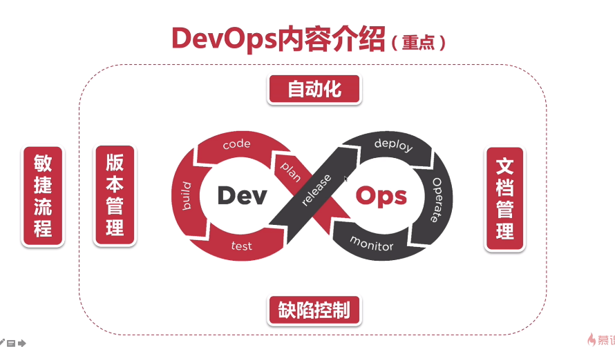
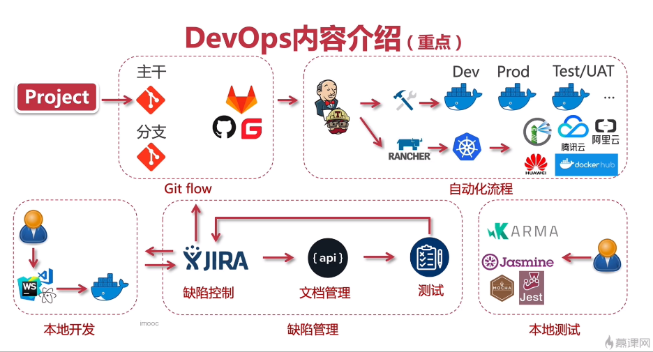
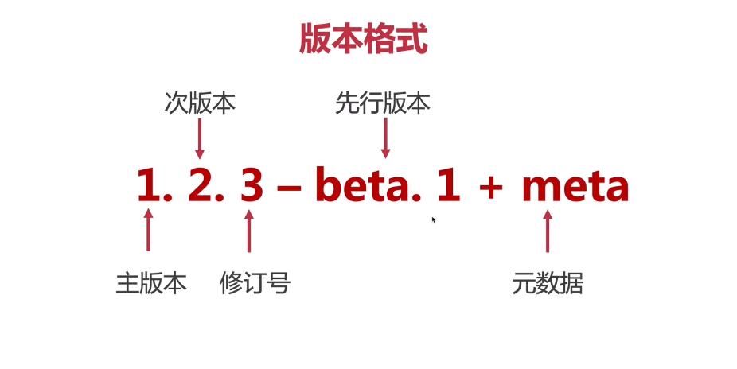
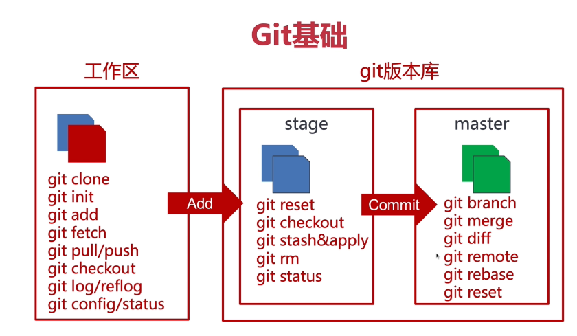
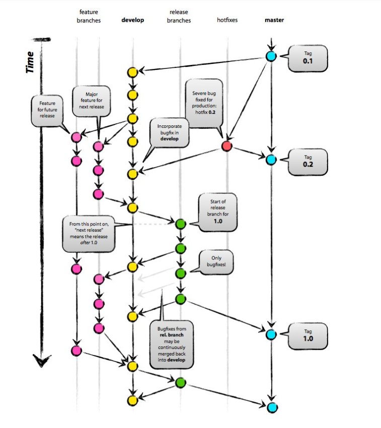
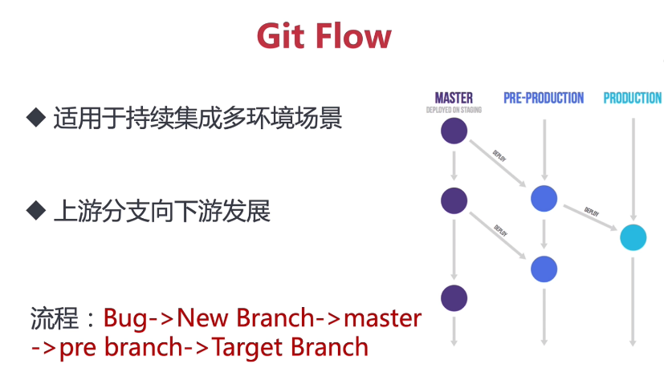

### 什么是团队协作? 
 
 
 
### 什么是Markdown? 
​	Markdown是一种**轻量级标记语言**,具有纯文本格式语法,可以转换成许多输出格式 
 
​	Markdown软件 **(Typora)** 
 
## 文档管理 

### 接口文档管理工具 
 
- **showdoc** 
- eoLinker 
- MinDoc 
- apizza 
 
 
 
### ShowDoc简介 
 
- 数据字典,接口模板 
- 团队协作 
- **免费开源**  
 
#### 使用docker方式安装  
    ssh root@10.0.0.44  
    123123 
     
    sudo systemctl start docker  
     
    docker pull star7th/showdoc 
##### 创建目录 
1. 创建目录,释放读写权限,运行镜像 
2. 转移数据,释放权限,放行端口 
3. 重新加载  
 
 
    mkdir /showdoc_data 
    mkdir /showdoc_data/html 
    chmod -R 777 /showdoc_data/ 
    docker run -d --name showdoc_test -p 13500:80 -v /showdoc_data/html/:/var/www/html/ star7th/showdoc  
     
    docker exec showdoc_test \cp -fr /showdoc_data/html/ /var/www/ 
    chmod -R 777 /showdoc_data/ 
    firewall-cmd --add-port=13500/tcp --permanent 
 
 

## 版本管理 

+ 语义化版本,git基础 
+ git flow及团队协作 
+ gitlab/github/gitee等使用,私有部署方案 
 
 #### semver 语义化版本(Semantic Versioning)
 
 + 主版本: 接口重写,版本更新迭代等
 + 次版本: 接口调整等
 + 修订号: 小改动
 + 先行版本: alpha:内测(多bug) beta:公测(持续加入新功能) rc:发行候选版本(排错,修复bug) release(发布版)
 + 元数据: 给先行版本打个标签
 
 #### 版本控制工具Git
 + 常用git平台:github,gitlab,gitea,gitee
 + git flow:团队协作,分支管理

 #### Git Flow
 
 
