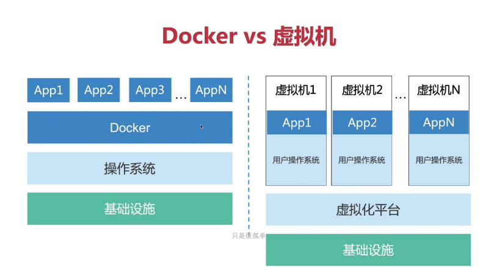

## 关于Docker
Docker 是一个开源的`应用容器`引擎，让开发者可以打包他们的应用以及依赖包到一个可移植的镜像中，然后发布到任何流行的 Linux或Windows 机器上，也可以实现虚拟化。容器是完全使用`沙箱`机制，相互之间不会有任何接口。
###如何在Windows系统下安装Docker?
1.[下载Docker-Desktop-For-Windows](https://hub.docker.com/search/?q=docker%20toolbox&type=edition&offering=community)

2.判断电脑系统是否为Windows10 Pro _如果不是则去淘宝买一个激活码升级_

3.打开`控制面板>程序>程序和功能`点击`启用或关闭Windows功能`开启`Hyper-V`

4.重启电脑进入`BIOS`控制面板,开启虚拟化

5.以上步骤操作完毕后打开`cmd`输入`docker -v`出现版本号即安装成功

###如何在MacOS系统下安装Docker?
1.[下载Docker-Desktop-For-MacOS](https://hub.docker.com/editions/community/docker-ce-desktop-mac)

2.[下载Docker-Compose](https://docs.docker.com/compose/install/)

3.以上步骤操作完毕后打开`cmd`输入`docker -v`出现版本号即安装成功

###如何在CentOs系统下安装Docker?
1.删除旧的docker
    
    sudo yum remove docker \
                    docker-client \
                    docker-client-latest \
                    docker-common \
                    docker-latest \
                    docker-latest-logrotate \
                    docker-logrotate \
                    docker-engine

2.安装必须的依赖:
    
    sudo yum install -y yum-utils \
    device-mapper-persistent-data \
    lvm2
3.配置docker仓库
    
    sudo yum-config-manager \
        --add-repo \
        https://download.docker.com/linux/centos/docker-ce.repo    
4.安装docker
    
    sudo yum install docker-ce docker-ce-cli containerd.io
    
5.启动docker
    
    sudo systemctl start docker
6.配置镜像
   + 第一种配置方式
        
            vi /etc/docker/daemon.json
            {
            "registry-mirror":["https://registry.docker-cn.com"]
            }
   + 第二种配置方式
        
             docker --registry-mirror=https://registry.docker-cn.com 
    
###什么是Docker-Compose?
使用 Docker Compose 可以轻松、高效的管理容器，它是一个用于**定义和运行多容器** Docker 的应用程序工具

+ 正常情况下使用curl命令安装
        
        sudo curl -L https://github.com/docker/compose/releases/download/1.21.2/docker-compose-$(uname -s)-$(uname -m) -o /usr/local/bin/docker-compose
+ 如果系统没有安装curl,可以采用wget来安装,并且增加权限
        
        sudo wget -O /usr/local/bin/docker-compose https://github.com/docker/compose/releases/download/1.23.1/docker-compose-`uname -s`-`uname -m`
        sudo chmod +x /usr/local/bin/docker-compose
###Docker常用操作
####如何获取容器?
**获取MongoDB**:

    docker pull mongo:4

####如何执行容器?
**执行MongoDB**:
    
    docker run -d --name some-mongo -p 10050:27017 mongo:4

####如何查看正在执行的容器?
**查看正在执行的容器**:
    
    docker ps

####如何查看本地下载的镜像
**查看本地镜像**:

    docker images
    
####Docker VS 虚拟机

  

####Docker主要特性
 + 文件,资源,网络隔离

 + **变更管理**，日志记录
 
 + **写时复制**
 
####Docker命令
 + `docker rm name` :删除name容器
 + `docker stop name` :停止name容器
 + `docker run --name subscription_mysql -e MYSQL_ROOT_PASSWORD=123456 -d mysql`:运行mysql
 + `docker logs -f name`:持续打印容器

####连接navicat报错1251的解决方法
 1. 进入mysql容器内部
        
        dokcer exec -it subscription_mysql bash
 2. 登录mysql
 
        mysql -u root -p
        
 3. 设置用户配置项
 
    (1) 查看用户
            
        select host,user,plugin,authentication_string from mysql.user;               
    **host为 % 表示不限制ip localhost表示本机使用 plugin非mysql_native_password 则需要修改密码**
    
    (2) 修改加密方式
    
        ALTER USER 'root'@'%' IDENTIFIED WITH mysql_native_password BY '123456';  ### 123456 mysql的登录密码
        flush privileges;

####使用docker-compose批操作
    cd /home/
    
    vi docker-compose.yml
    
    version:'3'
    services:
        mysql1:
            images:mysql
            environment:
            - MYSQL_ROOT_PASSWORD=123456    
            port:
            - 28002:3306
        
        mysql2:
            images:mysql
            environment:
            - MYSQL_ROOT_PASSWORD=123456    
            port:
            - 28003:3306
    
    
    docker-compose up
    docker-compose start    
    docker-compose stop
**可以看得出来docker-compose的操作和docker类似**
    
####如何推送镜像到远程仓库?
1.注册docker hub账户

2.登录docker
    
    docker login
3.提交镜像
    
    docker commit equis17/mysql:1.0
4.push镜像
    
    docker commit equis17/mysql:1.0    
