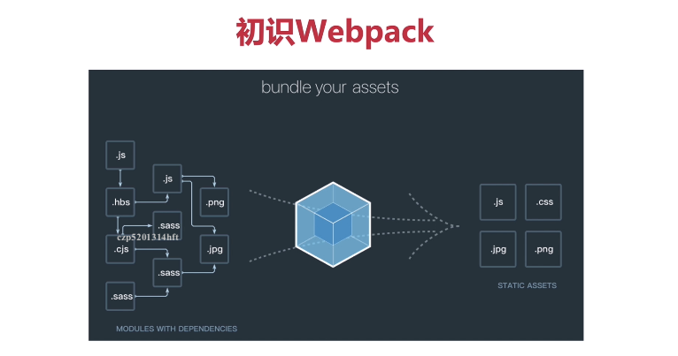

####什么是Webpack?

####Webpack核心概念
 - 入口
 - 输出
 - Loader
 - 插件
 - 兼容性/模式

####Webpack安装&使用
+ 初始化webpack项目
    - `npm init -y`
+ nvm, node, npm环境确认
    - `nvm install/use v10.16.0`
    - `node -v`
    - `npm -v`
+ 两种安装方式和三种使用方式
    - `npm install webpack webpack-cli -g`
    - `npx webpack`
    - `./node_modules/.bin/webpack`
    - `npm run`

####入口起点`entry points`
指定js文件为起点开始打包编译

**注意**:构建的项目输出到dist目录下

    const config = {
      entry: {
        app: './src/app.js',
        vendors: './src/vendors.js' //分离第三方包
      }
    };

####输出`output`
配置 `output` 选项可以控制 `webpack` 如何向硬盘写入编译文件。
    
  + `filename` 用于输出文件的文件名。
  + 目标输出目录 `path` 的绝对路径。
   
    
     output: {
        filename: 'bundle.js',
        path: '/home/proj/public/assets'
      }

####loader
loader 用于对模块的源代码进行转换。
    
  + loader 支持链式传递。能够对资源使用流水线(pipeline)。一组链式的 loader 将按照相反的顺序执行。loader 链中的第一个 loader 返回值给下一个 loader。在最后一个 loader，返回 webpack 所预期的 JavaScript。
  
  
    module: {
        rules: [
          { test: /\.scss$/, use: ['style-loader', 'css-loader','sass-loader'] },
        ]
      }

####插件`plugins`
解决loader无法实现的`其他事`

    plugins: [
        new webpack.optimize.UglifyJsPlugin(),
        new HtmlWebpackPlugin({template: './src/index.html'})
      ]

####模式`mode`
选项  | 描述
------------- | -------------
development  | 会将 process.env.NODE_ENV 的值设为 `development`。启用 `NamedChunksPlugin` 和 `NamedModulesPlugin`。
production  | 会将 process.env.NODE_ENV 的值设为 `production`。启用 `FlagDependencyUsagePlugin`, `FlagIncludedChunksPlugin`, `ModuleConcatenationPlugin`, `NoEmitOnErrorsPlugin`, `OccurrenceOrderPlugin`, `SideEffectsFlagPlugin` 和 `UglifyJsPlugin`.
